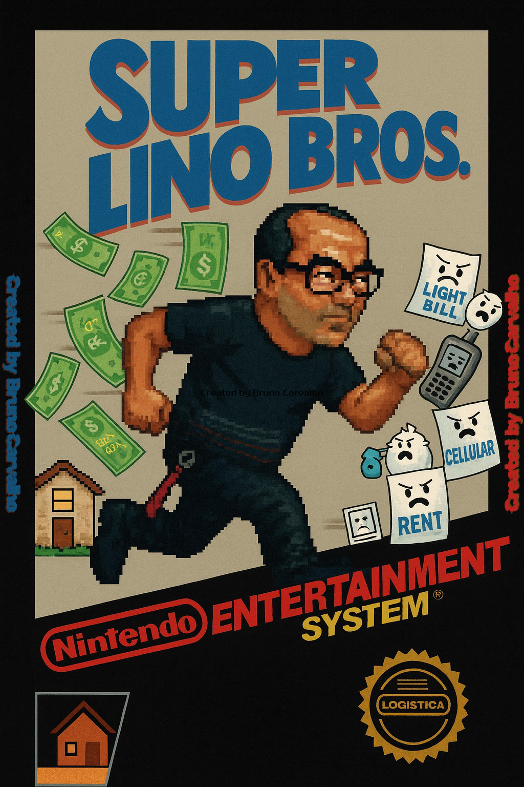

# Super Lino BROS

Super Lino BROS é uma aplicação web no estilo endless runner, desenvolvida com HTML, CSS e JavaScript puro. No jogo, o personagem "Lino" — inspirado em uma figura real do meu ambiente de trabalho — precisa correr e desviar de obstáculos até conseguir chegar em casa com seu salário, antes que as contas o alcancem.  

Esse projeto foi criado com o objetivo de aplicar conhecimentos práticos em lógica de programação, manipulação de DOM, responsividade e integração com backend (Firebase).

[🔗 Jogue agora](https://superlinobros.vercel.app)

---

---

## 🕹️ Funcionalidades principais

- Corrida infinita com obstáculos gerados dinamicamente
- Velocidade aumenta 0.5 a cada 10 pontos
- Personagem corre automaticamente
  - Controles: tecla **espaço** (PC) ou **toque na tela** (mobile)
- Sons personalizados para:
  - Pulo
  - Colisão
  - Música de fundo
  - Power-up
- Sistema de **power-up** ativado a cada 30 pontos
- Ranking com **Top 5 maiores pontuações**, usando Firebase
  - Registro de nome ao bater novo recorde

---

# 📷 Screenshot

---

# 🔥 Ranking

- Ranking em tempo real, persistido no **Firebase Realtime Database**
- Apenas scores dentro do Top 5 permitem o cadastro de nome
- Dados são carregados automaticamente ao iniciar o jogo

---

## 🧠 Conceitos e tecnologias aplicadas

- HTML5 semântico
- CSS3 para estilização responsiva
- JavaScript (vanilla) para lógica do jogo e manipulação de DOM
- Firebase para persistência e leitura de dados em tempo real
- Controle de fluxo de jogo com `setInterval` e `requestAnimationFrame`
- Detecção de colisão e controle de física de pulo simples

---

## 📁 Estrutura do projeto

- 📁 audio → Arquivos de som (música e efeitos sonoros)
- 📁 img → Imagens e sprites do jogo
- 📁 node_modules → Dependências do projeto (caso Firebase ou deploy local use npm)
- 📄 index.html → Estrutura principal da aplicação
- 📄 style.css → Estilos da interface e animações
- 📄 script.js → Toda a lógica do jogo (movimentação, colisão, score, power-up)
- 📄 package.json → Dependências e metadados do projeto
- 📄 package-lock.json → Detalhamento das versões instaladas

---

# 🧪 Melhorias futuras

- Sistema de vidas
- Novos power-ups
- Mais animações, personagens e fases
- Firebase Authentication para login de jogadores
- Tela de início mais personalizada/menu pause

---

# 👨‍💻 Sobre

Esse projeto foi desenvolvido como parte dos meus estudos de ADS (na Afya) e JS (Curso em Vídeo), com o objetivo de praticar lógica de programação, integração com serviços externos e desenvolvimento de uma aplicação completa do zero, com foco em front-end.

---

# 📫 Contato

- GitHub: [@bnocrv](https://github.com/bnocrv)
- LinkedIn: [@bnocrv](https://linkedin.com/in/bnocrv)
