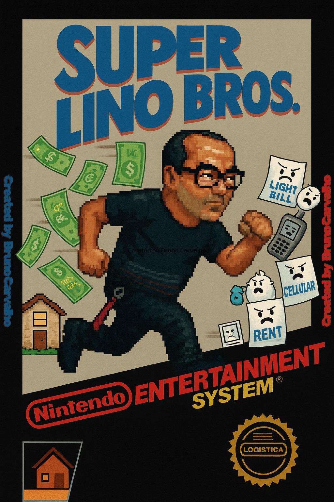

# Super Lino BROS

Endless runner web feito com HTML, CSS e JavaScript puro, com ranking online no Firebase Firestore, PWA, sprites animados, colisões precisas e interface responsiva inspirada em jogos 8-bit/NES com acabamento moderno.

[🔗 Jogar agora](https://superlinobros.vercel.app)


## Sobre o projeto

O jogador controla o Lino, que precisa correr, coletar moedas e escapar de obstáculos até chegar em casa com o salário antes que as contas o alcancem. O projeto nasceu como estudo prático de lógica e DOM, e foi evoluído com foco em organização, responsividade, experiência de jogo e integração com backend.

O objetivo técnico foi construir uma aplicação front-end completa sem framework, explorando canvas, animação, detecção de colisão, gerenciamento de estado, persistência remota e PWA.

## Destaques técnicos

- Game loop com `requestAnimationFrame`.
- Renderização do jogo em `<canvas>`.
- Controles por teclado, toque e botões mobile.
- Física simples de pulo, queda rápida e rolagem.
- Spawn progressivo de moedas e obstáculos.
- Dois chefes com marcos alternados de aparição.
- Hitboxes calculadas a partir da área real ocupada pelos sprites.
- Modo debug com tecla `H` para visualizar colisões.
- Ranking Top 5 persistido no Firebase Firestore.
- Formulário de ranking integrado ao Game Over, sem `prompt()` do navegador.
- PWA com `manifest.json`, ícones e service worker.
- Layout responsivo para desktop, mobile retrato e mobile paisagem.
- Tela inicial moderna com inspiração NES/8-bit.
- Assets grandes convertidos para JPEG para reduzir o carregamento inicial.

## Gameplay

- `Espaço` ou `Seta para cima`: pular.
- `Seta para baixo`: rolar no chão ou acelerar a queda no ar.
- `P`: pausar/continuar.
- `H`: mostrar/esconder hitboxes para depuração.
- Mobile: botões virtuais e gestos de toque.

## Chefes

- `Joe`: aparece nos marcos `50`, `150`, `250` e assim por diante.
- `Tonha`: aparece nos marcos `100`, `200`, `300` e assim por diante.

Cada marco dispara apenas uma vez, evitando respawn repetido quando a pontuação permanece no mesmo valor.

## Screenshot



## Como rodar localmente

```bash
npm install
npm run dev
```

Depois acesse a URL exibida no terminal.

Para validar rapidamente a sintaxe dos arquivos principais:

```bash
npm run check
```

## Estrutura

```text
.
├── audio/              # Efeitos sonoros e música
├── img/                # Sprites, cenários, ícones e screenshot
├── js/ranking.js       # Integração com Firestore e renderização segura do ranking
├── firebase.js         # Configuração do Firebase
├── index.html          # Estrutura da interface
├── manifest.json       # Configuração PWA
├── script.js           # Loop, estado, física, colisões e gameplay
├── service-worker.js   # Cache básico e cache sob demanda de assets locais
└── style.css           # Layout, responsividade e identidade visual
```

## Decisões de implementação

- JavaScript vanilla para demonstrar domínio dos fundamentos sem depender de framework.
- Canvas com resolução lógica fixa para simplificar física e colisões.
- CSS responsivo para adaptar a moldura do jogo sem alterar a lógica do canvas.
- Hitboxes proporcionais aos sprites para colisões mais justas.
- Firestore isolado em `js/ranking.js` para separar persistência do loop principal.
- `.gitignore` configurado para manter `node_modules` fora do repositório.

## Melhorias recentes

- Reestruturação do repositório e limpeza de arquivos não utilizados.
- Correções no service worker e no PWA.
- Ranking renderizado com DOM seguro em vez de `innerHTML` com dados externos.
- Ajustes finos de responsividade desktop/mobile.
- Tela inicial com estética moderna inspirada em NES/8-bit.
- Game Over e Pause revisados.
- Sistema de chefes Joe/Tonha.
- Otimização de fundos e screenshot.

## Próximos passos

- Modularizar mais partes do `script.js` (`player`, `boss`, `audio`, `input`).
- Converter `theme.wav` para um formato mais leve e adicionar novas trilhas.
- Adicionar testes automatizados para funções puras de colisão e agenda de bosses.
- Evoluir a tela de ranking com estados de loading/erro mais visuais.
- Adicionar novas fases e chefes e talvez a criação de um personagem auxiliar Lorenzo.

## Autor

Desenvolvido por Bruno Carvalho como projeto de estudo e portfólio front-end.

- GitHub: [@bnocrv](https://github.com/bnocrv)
- LinkedIn: [@bnocrv](https://linkedin.com/in/bnocrv)
